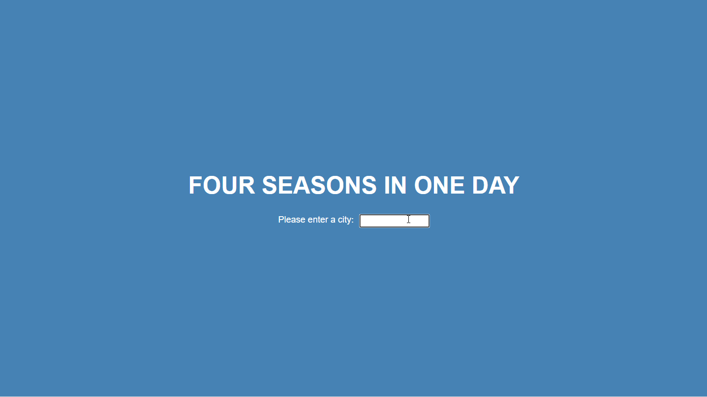

# Whatever the Weather

## ℹ About

Simple weather app

## 📚 Learning Outcomes

This app was built to practise React concepts including props, state, fetch and styled components.

I plan to use Jest for testing to get some practise using it in a basic application...

...not yet sure how! 🤔

## 🛠 Stack

This app is built with:

- React
- styled-components

## 🎥 Progress

So far the app allows users to search for a city to see they weather there.

## 🚧 Under Construction

This app displays MVP.

In the future, I would like to add geolocation functionality to show the weather for the users location when the app first loads. 
